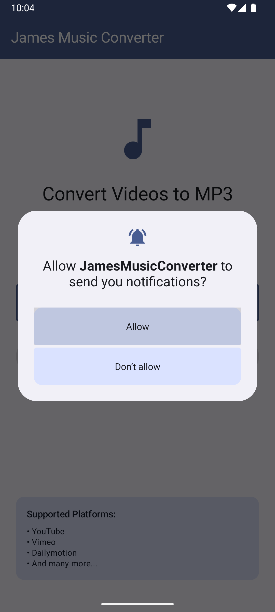
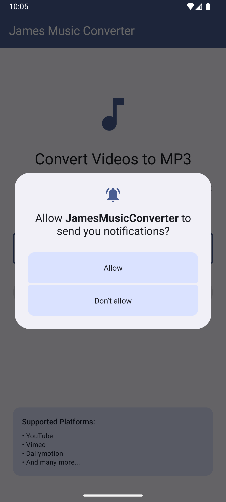
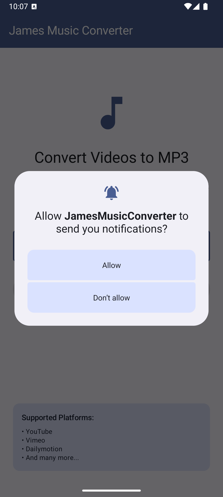
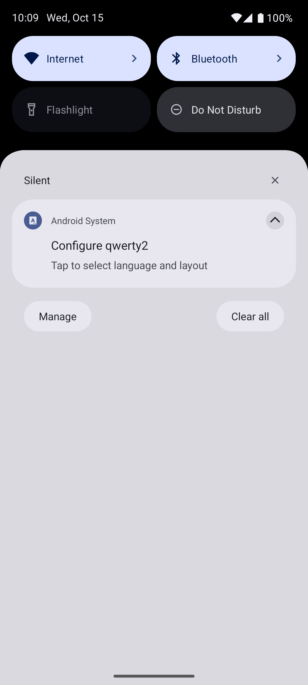

# James Music Converter 🎵

A fully functional Android application that downloads videos from YouTube and other platforms and converts them to high-quality MP3 audio files (320kbps).

## ✨ Features

- **🎬 Multi-Platform Support**: YouTube, Vimeo, TikTok, Instagram, Twitter/X, and 1000+ more platforms via yt-dlp
- **🎵 High-Quality MP3**: Converts to 320kbps MP3 using FFmpeg
- **📱 Smart Filename**: Uses actual video title as filename automatically
- **📊 Real-Time Progress**: Live progress tracking from 0-100% during download and conversion
- **🔔 Notifications**: Get notified when conversion completes, tap to play the MP3
- **▶️ Built-in Player**: Play MP3 directly from the app using your default music player
- **📂 File Management**: Open file location, share files with other apps
- **🎨 Modern UI**: Built with Jetpack Compose and Material 3 with white status bar icons
- **⚡ Direct URL Support**: Also supports direct video file URLs (.mp4, .webm, etc.)

## 📸 Screenshots

> **Note**: To add screenshots to this README, take screenshots of the app on your device/emulator and save them in a `screenshots/` folder, then update the image paths below.

<table>
  <tr>
    <td><br/><b>URL Input</b></td>
    <td><br/><b>Conversion Progress</b></td>
    <td><br/><b>Conversion Complete</b></td>
    <td><br/><b>Notification</b></td>
  </tr>
</table>

### How to capture screenshots:
1. Run the app on your device/emulator
2. Use Android Studio's screenshot tool or device screenshot button
3. Create a `screenshots/` folder in the project root
4. Save images as: `url_input.png`, `progress.png`, `completed.png`, `notification.png`

## 📱 How It Works

### Simple 3-Step Process:

1. **Enter URL**
   - Paste any YouTube, Vimeo, TikTok, or other supported video URL
   - Quick paste button for clipboard content

2. **Watch Progress**
   - Real-time download and conversion progress (0-100%)
   - Status updates: "Fetching video information...", "Downloading audio...", "Converting to MP3..."
   - Beautiful animated circular progress indicator

3. **Enjoy Your MP3**
   - Get notification when complete
   - Play immediately with built-in player integration
   - Share with messaging apps or other devices
   - Access file location for manual management

### Screens Overview

The app includes 4 main screens:

1. **🏠 URL Input Screen**
   - Clean text input with paste from clipboard support
   - URL validation
   - Material 3 design with primary color top bar

2. **⏳ Conversion Progress Screen**
   - Large animated circular progress indicator
   - Real-time percentage display
   - Status message updates
   - Smooth progress animation from 0-100%

3. **✅ Conversion Complete Screen**
   - Success confirmation with checkmark icon
   - File information card showing:
     - Video title
     - File name (uses actual video title)
     - File size (formatted in KB/MB/GB)
   - Action buttons:
     - **Play MP3** - Opens in your music player
     - **Open File Location** - View file in file manager
     - **Share File** - Share via other apps
     - **Convert Another Video** - Return to start

4. **❌ Error Screen**
   - Clear error messages with details
   - Helpful troubleshooting suggestions
   - Try Again button to return to URL input

## 🛠️ Technology Stack

### Core Technologies
- **Language**: Kotlin 2.0.21
- **UI Framework**: Jetpack Compose with Material 3
- **Navigation**: Custom NavDisplay system (type-safe navigation with Kotlin Serialization)
- **Min SDK**: Android 10 (API 29)
- **Target SDK**: Android 36
- **Build System**: Gradle with Kotlin DSL

### Download & Conversion Libraries
- **yt-dlp Integration**: `youtubedl-android` (v0.18.+) - YouTube and 1000+ platform support
- **FFmpeg**: `youtubedl-android-ffmpeg` (v0.18.+) - Audio format conversion to MP3
- **HTTP Client**: OkHttp 4.12.0 - Direct URL downloads
- **Coroutines**: Kotlin Flow for async progress tracking

### UI & UX
- **Material 3 Components**: TopAppBar, Cards, Buttons, Progress Indicators
- **Compose BOM**: 2025.08.00
- **Extended Material Icons**: Additional icon set
- **Coil**: Image loading library (2.7.0)
- **File Sharing**: AndroidX FileProvider for secure file access

## 🏗️ Architecture

### App Architecture
The app follows modern Android architecture with clean separation of concerns:

#### 1. **Presentation Layer** (`ui/`)
- Jetpack Compose screens with Material 3 components
- ViewModels for business logic (ConversionCompletedViewModel)
- Type-safe navigation with custom NavDisplay system

#### 2. **Domain Layer** (`domain/`)
- `ConversionRepository`: Orchestrates download and conversion flow
- `ConversionProgress`: Data class for progress updates (0-100%)
- `ConversionResult`: Data class for final MP3 output

#### 3. **Data Layer** (`data/service/`)
- `VideoDownloader`: Routes downloads (direct vs platform URLs)
- `YtDlpDownloader`: Handles yt-dlp integration for YouTube/platforms
- `AudioExtractor`: Manages audio file processing
- `DownloadNotificationService`: Notification management

### Conversion Flow
```
┌─────────────────┐
│   URL Input     │  User enters YouTube/video URL
└────────┬────────┘
         │
         ▼
┌─────────────────┐
│ VideoDownloader │  Detects URL type (platform vs direct)
└────────┬────────┘
         │
    ┌────┴────┐
    ▼         ▼
┌─────────┐  ┌──────────┐
│ YtDlp   │  │ OkHttp   │  Platform URLs → yt-dlp
│ (0-80%) │  │ (Direct) │  Direct URLs → OkHttp
└────┬────┘  └────┬─────┘
     │            │
     └──────┬─────┘
            ▼
     ┌──────────────┐
     │ YtDlp FFmpeg │  Convert to MP3 using -x --audio-format mp3
     │   (80-100%)  │  Output: 320kbps MP3 with video title as filename
     └──────┬───────┘
            ▼
     ┌──────────────┐
     │ Notification │  Notify user with tap-to-play action
     │   + Result   │  Store ConversionResult with file details
     └──────────────┘
```

### Navigation Flow
```
UrlInputRoute → ConversionProgressRoute → ConversionCompletedRoute
                                      ↓
                               ConversionErrorRoute
```

### Key Design Patterns
- **Repository Pattern**: `ConversionRepository` abstracts data sources
- **Flow-based Progress**: Kotlin Flow for reactive progress updates
- **FileProvider**: Secure file sharing between apps
- **Singleton Services**: Reused yt-dlp instance for efficiency

## 🚀 Building the Project

### Prerequisites
- Android Studio Hedgehog or later
- JDK 11 or later
- Android SDK with API 29+ (Android 10+)

### Quick Start

```bash
# Build the app
./gradlew build

# Install debug version to device/emulator
./gradlew installDebug

# Run tests
./gradlew test
```

## Project Structure

```
app/src/main/java/com/chuka/jamesmusicconverter/
├── MainActivity.kt                          # Entry point
├── JamesMusicConverterApplication.kt        # Application class
├── navigation/
│   ├── BackstackNavigation.kt              # Custom navigation system
│   ├── Routes.kt                            # Navigation routes
│   └── MusicConverterNavGraph.kt            # Navigation graph
├── ui/
│   ├── urlinput/
│   │   └── UrlInputScreen.kt               # URL entry screen
│   ├── progress/
│   │   └── ConversionProgressScreen.kt     # Progress animation
│   ├── completed/
│   │   └── ConversionCompletedScreen.kt    # Success screen
│   ├── error/
│   │   └── ConversionErrorScreen.kt        # Error screen
│   └── theme/                               # Material 3 theming
└── ...
```

## 📂 Project Structure

```
app/src/main/java/com/chuka/jamesmusicconverter/
├── MainActivity.kt                          # Entry point with status bar config
├── JamesMusicConverterApplication.kt        # Application class with yt-dlp init
├── navigation/
│   ├── BackstackNavigation.kt              # Custom navigation system
│   ├── Routes.kt                            # Serializable navigation routes
│   └── MusicConverterNavGraph.kt            # Main navigation graph
├── domain/
│   ├── model/
│   │   ├── ConversionProgress.kt           # Progress data (0-100%)
│   │   └── ConversionResult.kt             # Final MP3 result
│   └── repository/
│       └── ConversionRepository.kt          # Main business logic orchestration
├── data/
│   └── service/
│       ├── VideoDownloader.kt               # URL routing logic
│       ├── YtDlpDownloader.kt              # yt-dlp wrapper (YouTube, etc.)
│       ├── AudioExtractor.kt                # Audio file management
│       └── DownloadNotificationService.kt   # Notification handling
├── ui/
│   ├── urlinput/
│   │   ├── UrlInputScreen.kt               # URL entry screen
│   │   └── UrlInputViewModel.kt            # Input validation
│   ├── progress/
│   │   └── ConversionProgressScreen.kt     # Animated progress
│   ├── completed/
│   │   ├── ConversionCompletedScreen.kt    # Success screen
│   │   └── ConversionCompletedViewModel.kt # Play/share actions
│   ├── error/
│   │   └── ConversionErrorScreen.kt        # Error handling
│   └── theme/
│       ├── Color.kt                         # Material 3 colors
│       ├── Type.kt                          # Typography
│       └── Theme.kt                         # Theme configuration
└── res/
    └── xml/
        └── file_paths.xml                   # FileProvider paths
```

## ✅ Current Implementation Status

This app is **fully functional** and production-ready with yt-dlp integration:

### What's Working:
- ✅ YouTube video downloading and MP3 conversion (320kbps)
- ✅ Support for 1000+ platforms via yt-dlp (Vimeo, TikTok, Instagram, etc.)
- ✅ Real-time progress tracking (0-100%)
- ✅ Automatic filename using video title
- ✅ Download completion notifications with tap-to-play
- ✅ Play, share, and open file location features
- ✅ Error handling with user-friendly messages
- ✅ White status bar icons (works on light/dark themes)
- ✅ FileProvider for secure file sharing

### Key Files:
- `YtDlpDownloader.kt` - Main downloader using yt-dlp library with FFmpeg
- `VideoDownloader.kt` - Smart routing (detects platform URLs vs direct URLs)
- `ConversionRepository.kt` - Orchestrates the entire conversion flow
- `DownloadNotificationService.kt` - Handles completion notifications

### Output:
- **Format**: MP3 (320kbps, best quality)
- **Location**: `Android/data/com.chuka.jamesmusicconverter/files/Download/JamesMusicConverter/`
- **Filename**: Actual video title (e.g., "Best Song Ever.mp3")

## 🧪 Testing

### Test with a YouTube URL:
```
https://www.youtube.com/watch?v=dQw4w9WgXcQ
```

Or any other supported platform URL:
- YouTube: `youtube.com/watch?v=...`
- YouTube Shorts: `youtube.com/shorts/...`
- Vimeo: `vimeo.com/...`
- TikTok: `tiktok.com/@.../video/...`
- Twitter/X: `twitter.com/.../status/...`

### Expected Behavior:
1. Enter URL and tap "Start Conversion"
2. Progress shows: "Initializing yt-dlp..." → "Fetching video information..." → "Downloading audio..." → "Audio ready"
3. Notification appears: "Download Complete" with file name
4. Completion screen shows file details with Play button
5. Tap Play to open in your music player

## 📝 Permissions

The app requires these permissions (automatically requested at runtime):
- `INTERNET` - Download videos
- `POST_NOTIFICATIONS` - Show completion notifications (Android 13+)
- `READ_MEDIA_AUDIO` - Access downloaded MP3 files (Android 13+)
- `READ_EXTERNAL_STORAGE` - Access files on older Android versions (API 29-32)

## License

This project is based on the NavDisplay navigation pattern from the NavDisplayDemo project.
